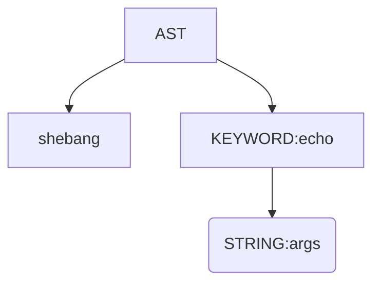

# Design python transpiler using AST 
## Approach:
command line -> node object (input tokens, logic based on node objected created) -> evaluate the node object (translation to python code) 

### Tokenise
KEYWORD, STRING, GLOB, VAR,
### Parser
def parse(tokens):
    ast = []
    i = 0
    while i < len(tokens):
        if tokens[i] == ("NEWLINE", "\n"):
            i += 1
            continue
        statement, i = parse_statement(tokens, i)
        ast.append(statement)
    return ast

def parse_statement(tokens, i):
    # collect words until PIPE, REDIRECT, or NEWLINE
    # if you hit PIPE -> build PipeNode
    # if you hit REDIRECT -> build RedirectNode
    # otherwise -> build CommandNode

### Evaluator

solutions:
maybe store the object called the variable name
or i can find the $a and refer to the same object in the AST

to do: 
[ ] reference implementation
[ ] new line for each command